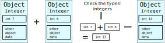

.. _cython:

Cython
======

.. questions::

   - Q1
   - Q2
.. objectives::

   - O1
   - O2

Interpreted languages like Python are rather slow to execute compared to
languages like C or Fortran that are compiled to machine code before execution.
Python in particular is both strongly typed and dynamically typed: this means
that all variables have a type that matters for operations that
can be performed on the variable, and that the type is determined only during
runtime by the Python interpreter. The interpreter does a lot of
"unboxing" of variable types when performing operations, and this comes with
significant overhead. For example, when just adding two integers

.. code:: python
   
   a = 7
   b = 6
   c = a + b
   
the Python interpreter needs to:

  1. Check the types of both operands
  2. Check whether they both support the **+** operation
  3. Extract the function that performs the **+** operation (due to operator
     overloading objects can have a custom definition for addition)
  4. Extract the actual values of the objects
  5. Perform the **+** operation
  6. Construct a new integer object for the result ("boxing")

TODO non-transparent figure

  .. image:: img/cython/unboxing-boxing.svg
   :class: center
   :width: 90.0%

Meanwhile in languages like C, the types are known at compilation time, which
allows the compiler to optimize many of the above steps away for better
performance at runtime.

Scientific programs often include computationally expensive sections (e.g.
simulations of any kind). So how do we make Python execute our code faster in
these situations? Well that's the neat part: we don't! Instead, we write the
performance critical parts in a faster language and make them usable from
Python.

Cython
------

Cython is an optimising static compiler for Python that also provides
its own programming language as a superset for standard Python.

`Cython <https://cython.org/>`__ is designed to provide C-like
performance for a code that is mostly written in Python by adding only a
few C-like declarations to an existing Python code. As such, Cython
provides the best of the both Python and C worlds: the good programmer
productivity of Python together with the high performance of C.
Especially for scientific programs performing a lot of numerical
computations, Cython can speed up the execution times more than an order
of magnitude. Cython makes it also easy to interact with external C/C++
code.

Cython works by transferring existing Python/Cython code into C code,
albeit in a form that is generally not easily readable by humans. The
resulting C-code calls functions from Python C application programming
interface (API), and thus requires an existing Python compiler and
runtime system. The Cython generated code is compiled into a Python
module. Normally, this module cannot be used as such, but needs to be
imported from a Python program that uses the functionality implemented
in Cython.

The main mechanism of how Cython speeds up Python programs is by adding
static declarations for variables. Thus, one loses some of the dynamic
nature of Python when working with Cython. This works best for
fundamental data types (integers, floats, strings) and contiguous arrays
(such as NumPy arrays), operations on lists and dictionaries do not
normally benefit much from Cython.

In summary, Cython can alleviate the following Python performance
bottlenecks discussed in Week 1:

-  Interpretation overhead
-  Unboxing / boxing Python objects
-  Overheads of Python control structures
-  Function call overheads

Creating Cython modules
------------------------

Normally, when working with Cython one does not Cythonize the whole
program but only selected modules.

Suppose we have a Python module named **my_module.py** that defines a
function called **add**:

.. code:: python

   def add(x, y):
       result = x + y
       return result

This function could then be used from some other Python code for example as:

.. code:: python

   from my_module import add

   z = add(4, 5)

Cython can transform this Python code into an equivalent C-code utilizing
the Python API as:

.. code:: bash

   $ cython my_module.py

The result is a file **my_module.c**, which could be compiled into a Python
extension module using a C-compiler. One can investigate the generated **.c**
file but it is not really meant for humans to read (already this simple
function results in over 4000 lines of C code)!

A typical Cython project is separated into plain Python modules (file
extension **.py**) and Cython modules (extension **.pyx**). One usually uses
established build tools to Cythonize and compile code that
estalished ubild tools to Cythonize and compile the **.pyx** files while
leaving the **.py** files as such. One common approach is to use
**setuptools** (see section on packaging) with a Cython stage specified in
**setup.py**: 

.. code:: python

   from setuptools import setup
   from Cython.Build import cythonize

   setup(
      name='My cool app',
      ext_modules=cythonize("my_module.pyx"),
   )

In larger real-world projects one would list all **.pyx** files here.

One can then create the C-extension module with:

.. code:: bash

   $ python3 setup.py build_ext --inplace
   running build_ext
   building 'my_module' extension
   creating build
   creating build/temp.linux-x86_64-3.6
   gcc -pthread -Wno-unused-result -Wsign-compare -DDYNAMIC_ANNOTATIONS_ENABLED=1 -DNDEBUG -O2 -g -pipe -Wall -Wp,-D_FORTIFY_SOURCE=2 -fexceptions -fstack-protector-strong --param=ssp-buffer-size=4 -grecord-gcc-switches -m64 -mtune=generic -D_GNU_SOURCE -fPIC -fwrapv -fPIC -I/usr/include/python3.6m -c my_module.c -o build/temp.linux-x86_64-3.6/my_module.o
   gcc -pthread -shared ...

where the ``--inplace`` option places the C-extension in the current
directory. The end result is a .so file containing the C-extension that
can be imported and used just the same as the pure Python module:

.. code:: python

   from my_module import add

   z = add(4, 5)

As the C-extension implements the fully dynamic Python code (just using
the Python C-API), transforming the pure Python module into C-extension
gives normally only very modest speed-ups. However, as we will discuss
in the following steps, by adding Cython language extensions into the
code (so it is no longer valid Python code) it is possible to achieve
much more significant performance improvements.

Adding static type information
------------------------------

What if one knows that e.g. in a certain function the variables have
always the same type? That's where Cython steps in: Cython allows one to
add static typing information so that boxing and unboxing are not
needed, and one can operate directly with the actual values.

When Cythonizing a Python code, static type information can be added
either:

-  In function signatures by prefixing the formal arguments by their
   type
-  By declaring variables with the **cdef** Cython keyword, followed by
   the the type

For example, a simple Python function adding two objects could be
Cythonized as follows:

.. code:: python

   def add (int x, int y):
       cdef int result
       result = x + y
       return result

The function works now only with integers but with less boxing/unboxing
overheads.

The types provided in Cython code are C types, and the variables with
type information are pure C variables and not Python objects. When
calling a Cythonized function from Python, there is an automatic
conversion from the Python object of actual arguments to the C value of
formal argument, and when returning a C variable it is converted to
corresponding Python object. Automatic conversions are carried out also
in most cases within the Cython code where both Python objects and C
variables are involved.

The table below lists the most common C types and their corresponding
Python types. More information can be found in the `Cython
documentation <https://cython.readthedocs.io/en/latest/src/userguide/language_basics.html>`__.

================= =============
From Python types To C types
================= =============
int               int, long
int, float        float, double
str/bytes         char \*
================= =============

============= ===============
From C types  To Python types
============= ===============
int, long     int
float, double float
char \*       str/bytes
============= ===============

“Boxing”
--------

-  In Python, everything is an object

Static type declarations
------------------------

-  Cython extended code should have .pyx ending

   -  Cannot be run with normal Python

-  Types are declared with ``cdef`` keyword

   -  In function signatures only type is given

.. container:: column

   .. code:: python

      def integrate(f, a, b, N):
          s = 0
          dx = (b - a) / N
          for i in range(N):
              s += f(a + i * dx)
          return s * dx

.. container:: column

   .. code:: python

      def integrate(f, double a, double b, int N):
          cdef double s = 0
          cdef int i
          cdef double dx = (b - a) / N
          for i in range(N):
              s += f(a + i * dx)
          return s * dx

.. _static-type-declarations-1:

Static type declarations
------------------------

-  Pure Python: 5.55 s
-  Static type declarations in kernel: 100 ms

.. container:: column

   .. code:: python

      def kernel(double zr, double zi, ...):
          cdef int count = 0

          while ((zr*zr + zi*zi) < (lim*lim)) 
                  and count < cutoff:
              zr = zr * zr - zi * zi + cr
              zi = zr * zr - zi * zi + cr
              count += 1

          return count

.. container:: column

   .. image:: img/cython/fractal.svg
      :class: center
      :width: 80.0%

Function call overhead
----------------------

-  Function calls in Python can involve lots of checking and “boxing”
-  Overhead can be reduced by declaring functions to be C-functions

   -  **cdef** keyword: functions can be called only from Cython
   -  **cpdef** keyword: generate also Python wrapper

.. container:: column

   .. code:: python

      def integrate(f, a, b, N):
          s = 0
          dx = (b - a) / N
          for i in range(N):
              s += f(a + i * dx)
          return s * dx

.. container:: column

   .. code:: python

      cdef double integrate(f, double a, ...):
          cdef double s = 0
          cdef int i
          cdef double dx = (b - a) / N
          for i in range(N):
              s += f(a + i * dx)
          return s * dx

Using C functions
-----------------

-  Static type declarations in kernel: 100 ms
-  Kernel as C function: 69 ms

.. container:: column

   .. code:: python

      cdef int kernel(double zr, double zi, ...):
          cdef int count = 0
          while ((zr*zr + zi*zi) < (lim*lim)) 
                  and count < cutoff:
              zr = zr * zr - zi * zi + cr
              zi = zr * zr - zi * zi + cr
              count += 1
          return count

.. container:: column

   .. image:: img/cython/fractal.svg
      :class: center
      :width: 80.0%

NumPy arrays with Cython
-------------------------

-  Cython supports fast indexing for NumPy arrays
-  Type and dimensions of array have to be declared

.. code:: python

   import numpy as np    # normal NumPy import
   cimport numpy as cnp  # import for NumPY C-API

   def func(): # declarations can be made only in function scope
       cdef cnp.ndarray[cnp.int_t, ndim=2] data
       data = np.empty((N, N), dtype=int)

       ...

       for i in range(N):
           for j in range(N):
               data[i,j] = ... # double loop is done in nearly C speed

Compiler directives
-------------------

-  Compiler directives can be used for turning of certain Python
   features for additional performance

   -  boundscheck (False) : assume no IndexErrors
   -  wraparound (False): no negative indexing
   -  …

.. code:: python

   import numpy as np    # normal NumPy import
   cimport numpy as cnp  # import for NumPY C-API

   import cython

   @cython.boundscheck(False)
   def func(): # declarations can be made only in function scope
       cdef cnp.ndarray[cnp.int_t, ndim=2] data
       data = np.empty((N, N), dtype=int)

Final performance
-----------------

-  Pure Python: 5.5 s
-  Static type declarations: 100 ms
-  Kernel as C function: 69 ms
-  Fast indexing and directives: 15 ms

Where to add types?
-------------------

-  Typing everything reduces readibility and can even slow down the
   performance
-  Profiling should be first step when optimising

Profiling Cython code
---------------------

-  By default, Cython code does not show up in profile produced by
   cProfile
-  Profiling can be enabled for entire source file or on per function
   basis

.. code:: python

   # cython: profile=True
   import cython

   @cython.profile(False)
   cdef func():
       ...

.. code:: python

   # cython: profile=False
   import cython

   @cython.profile(True)
   cdef func():
       ...

Summary
-------

-  Cython is optimising static compiler for Python
-  Possible to add type declarations with Cython language
-  Fast indexing for NumPy arrays
-  At best cases, huge speed ups can be obtained

   -  Some compromise for Python flexibility

Further functionality in Cython
-------------------------------

-  Using C structs and C++ classes in Cython
-  Exceptions handling
-  Parallelisation (threading) with Cython
-  …

Interfacing external libraries
------------------------------

Increasing performance with compiled code
-----------------------------------------

-  There are Python interfaces for many high performance libraries
-  However, sometimes one might want to utilize a library without Python
   interface

   -  Existing libraries
   -  Own code written in C or Fortran

-  Python C-API provides the most comprehensive way to extend Python
-  CFFI, Cython, and f2py can provide easier approaches

CFFI
----

-  C Foreign Function Interface for Python
-  Interact with almost any C code
-  C-like declarations within Python

   -  Can often be copy-pasted from headers / documentation

-  ABI and API modes

   -  ABI does not require compilation
   -  API can be faster and more robust
   -  Only API discussed here

-  Some understanding of C required

Creating Python interface to C library
--------------------------------------

-  In API mode, CFFI is used for building a Python extension module that
   provides interface to the library
-  One needs to write a *build* script that specifies:

   -  the library functions to be interfaced
   -  name of the Python extension
   -  instructions for compiling and linking

-  CFFI uses C compiler and creates the shared library
-  The extension module can then be used from Python code.

Example: Python interface to C math library
-------------------------------------------

.. code:: python

   from cffi import FFI
   ffibuilder = FFI()

   ffibuilder.cdef("""
       double sqrt(double x);  // list all the function prototypes from the
       double sin(double x);   // library that we want to use
                   """)

   ffibuilder.set_source("_my_math",  # name of the Python extension
   """
        #include <math.h>   // Some C source, often just include
   """,
      library_dirs = [],  # location of library, not needed for C 
                          # C standard library 
      libraries = ['m']   # name of the library we want to interface
   )

   ffibuilder.compile(verbose=True)

.. _example-python-interface-to-c-math-library-1:

Example: Python interface to C math library
-------------------------------------------

-  Building the extension

.. code:: bash

   python3 build_mymath.py
   generating ./_mymath.c
   running build_ext
   building '_mymath' extension
   ...
   gcc -pthread -shared -Wl,-z,relro -g ./_mymath.o -L/usr/lib64 -lm -lpython3.6m
   -o ./_mymath.cpython-36m-x86_64-linux-gnu.so

-  Using the extension

.. code:: python

   from _mymath import lib

   a = lib.sqrt(4.5)
   b = lib.sin(1.2)

-  Python ``float``\ s are automatically converted to C ``double``\ s
   and back

Passing NumPy arrays to C code
------------------------------

-  Only simple scalar numbers can be automatically converted Python
   objects and C types
-  In C, arrays are passed to functions as pointers
-  A “pointer” object to NumPy array can be obtained with ``cast`` and
   ``from_buffer`` functions

.. _passing-numpy-arrays-to-c-code-1:

Passing NumPy arrays to C code
------------------------------

.. container:: column

   -  C function adding two arrays

   .. code:: c

      // c = a + b
      void add(double *a, double *b, double *c, int n)
      {
        for (int i=0; i<n; i++)
           c[i] = a[i] + b[i];
      }

   -  Can be built into extension ``add_module`` with CFFI

.. container:: column

   -  Obtaining “pointers” in Python

   .. code:: python

      from add_module import ffi, lib

      a = np.random.random((1000000,1))
      aptr = ffi.cast("double *", ffi.from_buffer(a))
      ...

      lib.add(aptr, bptr, cptr, len(a))

   -  “pointer” objects resemble C pointers and can result easily in
      Segmentation faults!

.. _summary-1:

Summary
-------

-  External libraries can be interfaced in various ways
-  CFFI provides easy interfacing to C libraries

   -  System libraries and user libraries
   -  Python can take care of some datatype conversions
   -  “pointer” objects are needed for NumPy arrays

Acknowledgements
----------------

This material has been adapted from the "Python for HPC" course by CSC - IT Center for Science.