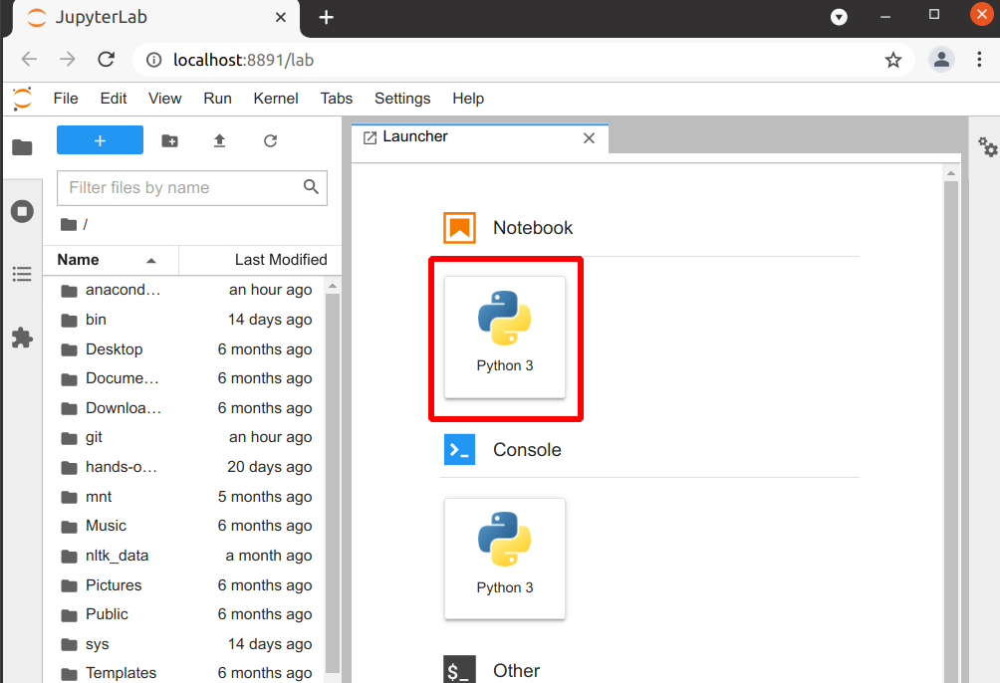

Software installation
=====================

This page contains instructions for installing the required software
on your computer.
Please make sure before the course that you have all the required software
installed or some other way access to it.  For example, the workshop could be done with a remote Jupyter
server, as long as you can use the terminal from the Jupyter (you need
to be able to access the command line for some lessons).

**If you need installation help, show this page to someone around you
and they can probably do all you need**

Generic list of tools required
------------------------------

Note: The actual installation instructions are below.  This is a
generic description which will help those who already understand all
of the tools.

* **Python 3** (Anaconda is recommended, it will include everything)

  * With some extra packages installed.  They are all included in
    Aanconda, and are listed in the ``environment.yml`` file you can
    find under miniconda below.
* Text editor (several lessons, can also be done through Jupyterlab)
* Command-line shell (several lessons, can also be done through Jupyterlab)
* git (not needed, this lesson is usually done as a demo)

.. admonition:: Generic instructions with miniconda and an environment file (advanced)
   :class: dropdown

   This is the advanced, minimal method of installing the Python
   packages.  For most people, we recommend Anaconda (below).  You
   will actually learn about miniconda during the workshop.  This
   doesn't provide the graphical Anaconda navigator, so you'll need to
   activate the miniconda environment using the command line.

   You can read how to install miniconda from the `CodeRefinery
   installation instructions
   <https://coderefinery.github.io/installation/conda/>`__.

   Then `this environment file
   <https://raw.githubusercontent.com/AaltoSciComp/python-for-scicomp/master/software/environment.yml>`__
   contains all packages needed, and can be installed with:

   .. code:: console

      $ conda env create -f https://raw.githubusercontent.com/AaltoSciComp/python-for-scicomp/master/software/environment.yml

   Each time you start a new shell, you need to activate miniconda (if
   you don't do run ``conda init``), and then you need to activate the
   proper environment with ``conda activate python-for-scicomp``.

   We might have missed some packages, though, which can be later
   installed with ``conda install``.

Python
------

We expect you to have a working Python installation with some common
libraries.  We recommend that you install the `Anaconda python
distribution <https://docs.continuum.io/anaconda/install/>`__.  The
`Anaconda Navigator <https://docs.anaconda.com/anaconda/navigator/>`__
provides a convenient way to access the software.

.. admonition:: Other options
   :class: toggle

   We recommend Anaconda, Anaconda Navigator, and JupyterLab in these
   instructions because it is simple and can be used by everyone.  As
   you advance in your career, we
   recommend that you explore other options as well, but
   that can come later.

   Any other Python distribution which you can install libraries into
   would work, but because there are so many different ways to do this,
   we don't support them.  You would need the extra libraries mentioned
   in the Miniconda instructions above.

JupyterLab
~~~~~~~~~~

We do most of the lessons from JupyterLab (and JupyterLab provides
most of the other tools we need).  If you install the full
Anaconda distribution, this will be available and can be started
either through Anaconda Navigator or command line.

Verification of Python and JupyterLab
~~~~~~~~~~~~~~~~~~~~~~~~~~~~~~~~~~~~~

.. admonition:: Watch the video

   See this `verification in video form
   <https://youtu.be/OEX1ss_HCHc>`__ - if you can do this, you are
   ready to go for day one.  Your exact steps may be a bit different.

**You should be able to start JupyterLab.**  You can do this from the
`Anaconda Navigator <https://docs.anaconda.com/anaconda/navigator/>`__ (recommended if you have it):

.. figure:: img/installation/anaconda-navigator-jupyterlab.png
   :class: with-border

   Starting JupyterLab from the Anaconda Navigator.

... or you can start JupyterLab from the command line:

.. code-block:: console

   $ jupyter-lab
   (... Jupyter starts in a web browser)

**Verify that you can start a Jupyter notebook.** We will learn how to
do this in day 1, but you can try running ``print("Hello, world!")``
if you want.

   Starting a Jupyter Notebook from JupyterLab.

Text editor
-----------

For one portion of the course, you will need a text editor.  **If you
don't know what to use, you can use the text editor that comes from
JupyterLab and it will do everything you need - no extra installation
needed.**

.. admonition:: Other editors
   :class: toggle

   Because we need to be simple in our teaching, we only teach the
   most basic editors.  We encourage you to try out more advanced ones
   yourself.

   For other editors, see the `CodeRefinery instructions
   <https://coderefinery.github.io/installation/editors/>`__.  You don't
   exactly need a terminal editor - the graphical ones, such as VSCode or
   whatever you use now, will work as well.

Command line
------------

**You need access to the command line for some lessons.  JupyterLab
includes it, so no extra installation is needed.**  If you want to
test in advance:

* You can start it from JupyterLab (recommended):

  .. figure:: img/installation/jupyterlab-terminal.png
     :class: with-border
     :scale: 75%

     From the JupyterLab launcher, select "Terminal".

.. admonition:: Other ways to access the command line
   :class: toggle

   * From the Anaconda Navigator:

     .. figure:: img/installation/anaconda-prompt.png
        :class: with-border

        From the Anaconda Navigator, you can select "environments" on the
        left, then click on one, then the arrow, then "Open terminal".

   * From your operating system's terminal applications, if you activate
     Anaconda.

Verification of the command line
~~~~~~~~~~~~~~~~~~~~~~~~~~~~~~~~

To verify command line usage, type the following commands (without the
``$``), and you should see the corresponding output that lists the
Python version:

.. code-block:: console

   $ python -V
   Python 3.8.3

   ## Or python3...
   $ python3 -V
   Python 3.8.3

Any version of Python 3 through a recent Anaconda should work for the
course.

Zoom
----

If this is an online workshop, it might use Zoom.  You can see
`CodeRefinery instructions for it
<https://coderefinery.github.io/installation/zoom/>`__.

Need help?
----------

If you have access, come to one of the installation help sessions.
Or, ask your colleagues: these are standard tools and you can
definitely find someone can help you get set up!

See also
--------

* `Research Software Hour on conda
  <https://www.youtube.com/watch?v=ddCde5Nu2qo&list=PLpLblYHCzJAB6blBBa0O2BEYadVZV3JYf>`__
* `Conda manual <https://docs.conda.io/en/latest/>`__ (technical)
* `Anaconda individual edition home
  <https://www.anaconda.com/products/individual>`__
* `Anaconda getting started
  <https://docs.anaconda.com/anaconda/user-guide/getting-started/>`__
