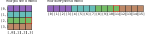
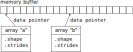

Advanced NumPy
==============

.. questions::

   - How can NumPy be so fast?
   - Why are some things fast and some things slow?
   - How can I control whether NumPy makes a copy or operates in-place?

.. objectives::

   - Understand why NumPy has so many specialized functions for specific operations
   - Understand the underlying machinery of the Numpy :class:`~numpy.ndarray` object
   - Understand when and why NumPy makes a copy of the data rather than a view

   This is intended as a follow-up to the :doc:`basic NumPy lesson <numpy>`.  The intended
   audience for this advanced lesson is those who have used NumPy before and
   now want to learn how to get the most out of this amazing package.

Python, being an interpreted programming language, is quite slow. Manipulating
large amounts of numbers using Python's build-in lists would be impractically
slow for any serious data analysis. Yet, the NumPy package can be really
fast. How does it do that? We will dive into how NumPy works behind the scenes
and use this knowledge to our advantage. This lesson also serves as an
introduction to reading the definitive work on this topic:
`Guide to NumPy <http://web.mit.edu/dvp/Public/numpybook.pdf>`_ by
Travis E. Oliphant, its initial creator.

NumPy can be really fast
------------------------

Python, being an interpreted programming language, is quite slow. Manipulating
large amounts of numbers using Python's build-in lists would be impractically
slow for any serious data analysis. Yet, the numpy package can be really fast.

.. highlight:: c

How fast can NumPy be? Let's race NumPy against C. The contest will be to sum
together 100 000 000 random numbers. We will give the C version below, you get
to write the NumPy version::

  #include <stdlib.h>
  #include <stdio.h>
  #define N_ELEMENTS 100000000
  int main(int argc, char** argv) {
      double* a = (double*) malloc(sizeof(double) * N_ELEMENTS);
      int i;
      for(i=0; i<N_ELEMENTS; ++i) {
          a[i] = (double) rand() / RAND_MAX;
      }
      double sum = 0;
      for(i=0; i<N_ELEMENTS; ++i) {
          sum += a[i];
      }
      printf("%f", sum);
      return 0;
  }

Exercise 1
----------

.. challenge:: Exercises: Numpy-Advanced-1

   Write a Python script that uses NumPy to generate 100 million (100000000)
   random numbers and add them all together. Time how long it takes to execute.
   Can you beat the C version?

   If you are having trouble with this, we recommend completing the
   :ref:`basic NumPy lession <numpy>` before continuing with this
   advanced lesson.  If you are taking a live course - don't
   worry, watch and learn and explore some during the exercises!

.. solution:: Solutions: Numpy-Advanced-2

   The script can be implemented like this::

     import numpy as np
     print(np.random.rand(100_000_000).sum())

.. highlight:: python

The libraries behind the curtain: MKL and BLAS
----------------------------------------------

NumPy is fast because it outsources most of its heavy lifting to heavily
optimized math libraries, such as Intel's `Math Kernel Library (MKL) <https://www.intel.com/content/www/us/en/develop/documentation/oneapi-programming-guide/top/api-based-programming/intel-oneapi-math-kernel-library-onemkl.html>`_,
which are in turn derived from a Fortran library called
`Basic Linear Algebra Subprograms (BLAS) <https://en.wikipedia.org/wiki/Basic_Linear_Algebra_Subprograms>`_.
BLAS for Fortran was `published in 1979 <https://doi.org/10.1145/355841.355847>`_
and is a collection of algorithms for common mathematical operations that are
performed on arrays of numbers. Algorithms such as matrix multiplication,
computing the vector length, etc. The API of the BLAS library was later
standardized, and today there are many modern implementations available. These
libraries represent over 40 years of optimizing efforts and make use of
`specialized CPU instructions for manipulating arrays <https://www.youtube.com/watch?v=Pc8DfEyAxzg&list=PLzLzYGEbdY5lrUYSssHfk5ahwZERojgid>`_.
In other words, they are *fast*.

One of the functions inside the BLAS library is a
`function <https://www.intel.com/content/www/us/en/develop/documentation/onemkl-developer-reference-c/top/blas-and-sparse-blas-routines/blas-routines/blas-level-1-routines-and-functions/cblas-nrm2.html#cblas-nrm2>`_
to compute the "norm" of a vector, which is the same as computing its length, using the
`Pythagorean theorem <https://en.wikipedia.org/wiki/Pythagorean_theorem>`_:
:math:`\sqrt(a[0]^2 + a[1]^2 + \ldots)`.

Let's race the BLAS function versus a naive "manual" version of computing the vector norm.
We start by creating a decently long vector filled with random numbers::

  import numpy as np
  rng = np.random.default_rng(seed=0)
  a = rng.random(100_000_000)

We now implement the Pythagorean theorem using basic NumPy functionality and
use ``%%timeit`` to record how long it takes to execute::

  %%timeit
  l = np.sqrt(np.sum(a ** 2))
  print(l)

And here is the version using the specialized BLAS function :func:`~numpy.linalg.norm`::

  %%timeit
  l = np.linalg.norm(a)
  print(l)

NumPy tries to avoid copying data
----------------------------------

Understanding the kind of operations that are expensive (take a long time) and
which ones are cheap can be surprisingly hard when it comes to NumPy. A big
part of data processing speed is memory management. Copying big arrays takes
time, so the less of that we do, the faster our code runs. The rules of when
NumPy copies data are not trivial and it is worth your while to take a closer
look at them. This involves developing an understanding of how NumPy's
:class:`numpy.ndarray` datastructure works behind the scenes.

An example: matrix transpose
~~~~~~~~~~~~~~~~~~~~~~~~~~~~
Transposing a matrix means that all rows become columns and all columns become
rows. All off-diagonal values change places. Let's see how long NumPy's
transpose function takes, by transposing a huge (10 000 ✕ 20 000)
:func:`~numpy.random.rand` matrix::

  import numpy as np
  a = np.random.rand(10_000, 20_000)
  print(f'Matrix `a` takes up {a.nbytes / 10**6} MB')

Let's time the :meth:`~numpy.ndarray.transpose` method::

  %%timeit
  b = a.transpose()

It takes mere nanoseconds to transpose 1600 MB of data! How?

The ndarray exposed
~~~~~~~~~~~~~~~~~~~
The first thing you need to know about :class:`numpy.ndarray` is that the
memory backing it up is always a flat 1D array. For example, a 2D matrix is
stored with all the rows concatenated as a single long vector.

NumPy is faking the second dimension behind the scenes! When we request the
element at say, ``[2, 3]``, NumPy converts this to the correct index in the
long 1D array ``[11]``.

 * Converting ``[2, 3]`` → ``[11]`` is called "raveling"
 * The reverse, converting ``[11]`` → ``[2, 3]`` is called "unraveling"

The implications of this are many, so take let's take some time to understand
it properly by writing our own ``ravel()`` function.

Exercise 2
----------

.. challenge:: Exercises: Numpy-Advanced-2

   Write a function called ``ravel()`` that takes the row and column of an
   element in a 2D matrix and produces the appropriate index in an 1D array,
   where all the rows are concatenated. See the image above to remind yourself
   how each row of the 2D matrix ends up in the 1D array.

   The function takes these inputs:

     - ``row`` The row of the requested element in the matrix as integer index.
     - ``col`` The column of the requested element in the matrix as integer index.
     - ``n_rows`` The total number of rows of the matrix.
     - ``n_cols`` The total number of columns of the matrix.

   Here are some examples of input and desired output:

     - ``ravel(2, 3, n_rows=4, n_cols=4)`` → ``11``
     - ``ravel(2, 3, n_rows=4, n_cols=8)`` → ``19``
     - ``ravel(0, 0, n_rows=1, n_cols=1)`` → ``0``
     - ``ravel(3, 3, n_rows=4, n_cols=4)`` → ``15``
     - ``ravel(3_465, 18_923, n_rows=10_000, n_cols=20_000)`` → ``69_318_923``

.. solution:: Solutions: Numpy-Advanced-2

   The function can be implemented like this::

     def ravel(row, col, n_rows, n_cols):
       return row * n_cols + col

Strides
-------

As seen in the exercise, to get to the next row, we have to skip over
``n_cols`` indices. To get to the next column, we can just add 1. To generalize
this code to work with an arbitrary number of dimensions, NumPy has the concept
of "strides"::

  np.zeros((4, 8)).strides           # (64, 8)
  np.zeros((4, 5, 6, 7, 8)).strides  # (13440, 2688, 448, 64, 8)

The :attr:`~numpy.ndarray.strides` attribute contains for each dimension, the number of *bytes* (not array indexes) we
have to skip over to get to the next element along that dimension. For example,
the result above tells us that to get to the next row in a 4 ✕ 8 matrix, we
have to skip ahead 64 bytes. 64? Yes! We have created a matrix consisting of
double-precision floating point numbers. Each one of those bad boys takes up 8
bytes, so all the indices are multiplied by 8 to get to the proper byte in the
memory array. To move to the next column in the matrix, we skip ahead 8 bytes.

So now we know the mystery behind the speed of :meth:`~numpy.ndarray.transpose`.  NumPy can avoid
copying any data by just modifying the :attr:`~numpy.ndarray.strides` of the array::

  import numpy as np

  a = np.random.rand(10_000, 20_000)
  b = a.transpose()

  print(a.strides)  # (160000, 8)
  print(b.strides)  # (8, 160000)

Another example: reshaping
~~~~~~~~~~~~~~~~~~~~~~~~~~
Modifying the shape of an array through :func:`numpy.reshape` is also
accomplished without any copying of data by modifying the :attr:`~numpy.ndarray.strides`::

  a = np.random.rand(20_000, 10_000)
  print(f'{a.strides=}')  # (80000, 8)
  b = a.reshape(40_000, 5_000)
  print(f'{b.strides=}')  # (40000, 8)
  c = a.reshape(20_000, 5_000, 2)
  print(f'{c.strides=}')  # (80000, 16, 8)

Exercises 3
-----------

.. challenge:: Exercises: Numpy-Advanced-3

    A little known feature of NumPy is the ``numpy.stride_tricks`` module
    that allows you to modify the :attr:`~numpy.ndarray.strides` attribute directly. Playing
    around with this is very educational.

    1. Create your own ``transpose()`` function that will transpose a 2D matrix
       by reversing its :attr:`~numpy.ndarray.shape` and :attr:`~numpy.ndarray.strides` attributes using
       :func:`numpy.lib.stride_tricks.as_strided`.
  
    2. Create a (5 ✕ 100 000 000 000) array containing on the first row all
       1's, the second row all 2's, and so on.  Start with an 1D array
       ``a = np.array([1., 2., 3., 4., 5.])``
       and modify its ``shape`` and ``strides`` attributes using
       :func:`numpy.lib.stride_tricks.as_strided` to obtain the desired 2D
       matrix::

         array([[1., 1., 1., ..., 1., 1., 1.],
                [2., 2., 2., ..., 2., 2., 2.],
                [3., 3., 3., ..., 3., 3., 3.],
                [4., 4., 4., ..., 4., 4., 4.],
                [5., 5., 5., ..., 5., 5., 5.]])

.. solution:: Solutions: Numpy-Advanced-3

   1. The ``transpose()`` function can be implemented like this::

         from numpy.lib.stride_tricks import as_strided
         def transpose(a):
           return as_strided(a, shape=a.shape[::-1], strides=a.strides[::-1])
  
         # Testing the function on a small matrix
         a = np.array([[1, 2, 3],
                       [4, 5, 6]])
         print('Before transpose:')
         print(a)
         print('After transpose:')
         print(transpose(a))

    2. By setting one of the ``.strides`` to `0`, we can repeat a value
       infinitely many times without using any additional memory::

         from numpy.lib.stride_tricks import as_strided
         a = np.array([1., 2., 3., 4., 5.])
         as_strided(a, shape=(5, 100_000_000_000), strides=(8, 0))

A fast thing + a fast thing = a fast thing?
-------------------------------------------

If :func:`numpy.transpose` is fast, and :func:`numpy.reshape` is fast, then
doing them both must be fast too, right?::

  # Create a large array
  a = np.random.rand(10_000, 20_000)
 
Measuring the time it takes to first transpose and then reshape::

  %%timeit -n 1 -r 1
  a.T.reshape(40_000, 5_000)

In this case, the data actually had to be copied and it's super slow (it takes
seconds instead of nanoseconds). When the array is first created, it is laid
out in memory row-by-row (see image above). The transpose left the data laid
out in memory column-by-column. To see why the copying of data was inevitable,
look at what happens to this smaller (2 ✕ 3) matrix after transposition and
reshaping. You can verify for yourself there is no way to get the final array
based on the first array and some clever setting of the :attr:`~numpy.ndarray.strides`::

  a = np.array([[1, 2, 3], [4, 5, 6]])
  
  print('Original array:')
  print(a)
  
  print('\nTransposed:')
  print(a.T)
  
  print('\nTransposed and then reshaped:')
  print(a.T.reshape(2, 3))

Copy versus view
----------------

Whenever NumPy constructs a new array by modifying the :attr:`~numpy.ndarray.strides` instead of
copying data, we way it created a "view". This also happens when we select only
a portion of an existing matrix. Whenever a view is created, the
:class:`numpy.ndarray` object will have a reference to the original array in
its :attr:`~numpy.ndarray.base` attribute::

  a = np.zeros((5, 5))
  print(a.base)  # None
  b = a[:2, :2]
  print(b.base.shape)  # (5, 5)

.. warning::
   When you create a large array and select only a portion of it, the large
   array will stay in memory if a view was created!

The new array ``b`` object has a pointer to the same memory buffer as the array
it has been derived from::

  print(a.__array_interface__['data'])
  print(b.__array_interface__['data'])

Views are created by virtue of modifying the value of the :attr:`~numpy.ndarray.shape` attribute
and, if necessary, apply an offset to the pointer into the memory buffer so it
no longer points to the start of the buffer, but somewhere in the middle::

  b = a[1:3, 1:3]   # This view does not start at the beginning
  offset = b.__array_interface__['data'][0] - a.__array_interface__['data'][0]
  print('Offset:', offset, 'bytes')  # Offset: 48 bytes

Since the base array and its derived view share the same memory, any changes to
the data in a view also affects the data in the base array::

  b[0, 0] = 1.
  print(a)  # Original matrix was modified

Whenever you index an array, NumPy will attempt to create a view. Whether or
not that succeeds depends on the memory layout of the array and what kind of
indexing operation was done. If no view can be created, NumPy will create a new
array and copy over the selected data::

  c = a[[0, 2]]  # Select rows 0 and 2
  print(c.base)  # None. So not a view.

See also
--------

* `Guide to Numpy <http://web.mit.edu/dvp/Public/numpybook.pdf>`__
* `NumPy manual <https://numpy.org/doc/stable/reference/>`__

  * `Basic array class reference <https://numpy.org/doc/stable/reference/arrays.html>`__
  * `Indexing
    <https://numpy.org/doc/stable/reference/arrays.indexing.html>`__
  * `ufuncs <https://numpy.org/doc/stable/reference/ufuncs.html>`__
  * `Advanced NumPy: Master stride tricks with 25 illustrated exercises <https://towardsdatascience.com/advanced-numpy-master-stride-tricks-with-25-illustrated-exercises-923a9393ab20>`__

.. keypoints::

   - The best way to make your code more efficient is to learn more about the
     NumPy API and use specialized functions whenever possible.
   - NumPy will avoid copying data whenever it can. Whether it can depends on
     what kind of layout the data is currently in.
