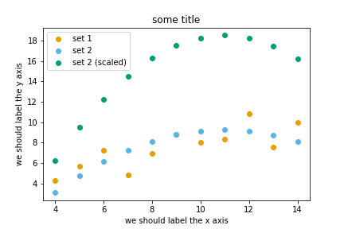

Data visualization with Matplotlib
==================================

.. questions::

   - Q1
   - Q2

.. objectives::

   - Know it exists
   - Make a simple plot
   - Know about object-oriented vs stateful interface
   - Headless rendering by setting backend
   - Know about other tools: seaborn, plotly, altair
   - Be able to adapt gallery examples

Repeatability/reproducibility
-----------------------------

From `Claus O. Wilke: "Fundamentals of Data Visualization" <https://clauswilke.com/dataviz/>`__:

    *One thing I have learned over the years is that automation is your friend. I
    think figures should be autogenerated as part of the data analysis pipeline
    (which should also be automated), and they should come out of the pipeline
    ready to be sent to the printer, no manual post-processing needed.*

- **No manual post-processing**. This will bite you when you need to regenerate 50
  figures one day before submission deadline or regenerate a set of figures
  after the person who created them left the group.
- **Use free tools**: Python or R.
- There is not the one perfect language and **not the one perfect library** for everything.
- Within Python, many libraries exist:
  `Matplotlib <https://matplotlib.org/>`__,
  `Seaborn <https://seaborn.pydata.org/>`__,
  `Altair <https://altair-viz.github.io/>`__,
  `Plotly <https://plotly.com/python/>`__,
  `Bokeh <https://bokeh.org/>`__,
  `ggplot <https://yhat.github.io/ggpy/>`__,
  `PyNGL <https://www.pyngl.ucar.edu/>`__,
  and many others.
- Two main families of libraries: procedural (e.g. Matplotlib) and declarative
  (using grammar of graphics).

Why are we learning matplotlib?
-------------------------------

- Matplotlib is perhaps the most "standard" Python plotting library.
- Many libraries build on top of Matplotlib.
- MATLAB users will feel familiar.
- Even if you choose to use another library (see above list), chances are high
  that you need to adapt a Matplotlib plot of somebody else.
- Libraries that built on top of Matplotlib may need knowledge of Matplotlib
  for custom adjustments.

Getting started with Matplotlib
-------------------------------

Let us create our first plot (the highlighted line is only needed in a Jupyter notebook
to show the generated figure in the notebook, we don't need this when running this as script):

.. code-block:: python
   :emphasize-lines: 1

   %matplotlib inline

   import matplotlib.pyplot as plt

   # this is dataset 1 from
   # https://en.wikipedia.org/wiki/Anscombe%27s_quartet
   data_x = [10.0, 8.0, 13.0, 9.0, 11.0, 14.0, 6.0, 4.0, 12.0, 7.0, 5.0]
   data_y = [8.04, 6.95, 7.58, 8.81, 8.33, 9.96, 7.24, 4.26, 10.84, 4.82, 5.68]

   fig, ax = plt.subplots()

   ax.scatter(x=data_x, y=data_y, c="#E69F00")

   ax.set_xlabel("we should label the x axis")
   ax.set_ylabel("we should label the y axis")
   ax.set_title("some title")

This is the result:

.. image:: data-visualization/getting-started.png

When plotting using a script, you often want to also save the generated figure:

.. code-block:: python
   :emphasize-lines: 3

   # ... rest of the script

   fig.savefig("my-plot.png")

   plt.show()

We also added ``plt.show()`` to show the figure on screen. We did not need this
in a Jupyter notebook.

When running a Matplotlib script on a remote server without a "display" (e.g.
compute cluster), you may need to add this line:

.. code-block:: python
   :emphasize-lines: 2

   import matplotlib.pyplot as plt
   matplotlib.use("Agg")

   # ... rest of the script

Exercise 4.1
------------

- Extend the previous plot by also plotting this set of values but this time
  using a different color (``#56B4E9``)::

    # this is dataset 2
    data2_y = [9.14, 8.14, 8.74, 8.77, 9.26, 8.10, 6.13, 3.10, 9.13, 7.26, 4.74]

- Then add another color (``#009E73``) which plots the second dataset, scaled
  by 2.0.

- Can you try to find out how to add a legend to the plot?

At the end it should look like this one:

Why these colors? This qualitative color palette is opimized for all color-vision
deficiencies, see https://clauswilke.com/dataviz/color-pitfalls.html and
`Okabe, M., and K. Ito. 2008. "Color Universal Design (CUD): How to Make Figures and Presentations That Are Friendly to Colorblind People." <http://jfly.iam.u-tokyo.ac.jp/color/>`__.

Matplotlib has two different interfaces
---------------------------------------

When plotting with matplotlib, it is very important to know and understand that
there are **two approaches** even though the reasons of this dual approach is
outside the scope of this lesson.

- The more modern option is an **object-oriented interface** (the ``fig`` and ``ax`` objects
  can be configured and passed around):

.. code-block:: python
   :emphasize-lines: 8-14

   import matplotlib.pyplot as plt

   # this is dataset 1 from
   # https://en.wikipedia.org/wiki/Anscombe%27s_quartet
   data_x = [10.0, 8.0, 13.0, 9.0, 11.0, 14.0, 6.0, 4.0, 12.0, 7.0, 5.0]
   data_y = [8.04, 6.95, 7.58, 8.81, 8.33, 9.96, 7.24, 4.26, 10.84, 4.82, 5.68]

   fig, ax = plt.subplots()

   ax.scatter(x=data_x, y=data_y, c="#E69F00")

   ax.set_xlabel("we should label the x axis")
   ax.set_ylabel("we should label the y axis")
   ax.set_title("some title")

- The more traditional option mimics MATLAB plotting and uses the **pyplot interface** (``plt`` carries
  the global settings):

.. code-block:: python
   :emphasize-lines: 8-12

   import matplotlib.pyplot as plt

   # this is dataset 1 from
   # https://en.wikipedia.org/wiki/Anscombe%27s_quartet
   data_x = [10.0, 8.0, 13.0, 9.0, 11.0, 14.0, 6.0, 4.0, 12.0, 7.0, 5.0]
   data_y = [8.04, 6.95, 7.58, 8.81, 8.33, 9.96, 7.24, 4.26, 10.84, 4.82, 5.68]

   plt.scatter(x=data_x, y=data_y, c="#E69F00")

   plt.xlabel("we should label the x axis")
   plt.ylabel("we should label the y axis")
   plt.title("some title")

When searching for help on the internet, you will find both approaches, they
can also be mixed. Although the pyplot interface looks more compact, **we
recommend to learn and use the object oriented interface.**

Exercise 4.2
------------

Imagine we wanted to learn how to create a histogram and web searched
"matplotlib plot histogram stack overflow" and found (https://stackoverflow.com/a/5328669):

.. code-block:: python

   import matplotlib.pyplot as plt
   import numpy as np

   mu, sigma = 100, 15
   x = mu + sigma * np.random.randn(10000)
   hist, bins = np.histogram(x, bins=50)
   width = 0.7 * (bins[1] - bins[0])
   center = (bins[:-1] + bins[1:]) / 2
   plt.bar(center, hist, align='center', width=width)
   plt.show()

- Try this example out in the Jupyter notebook.
- Change the number of bins.
- Convert it from pyplot interface to using the object oriented interface.

.. discussion::

   Why did we do this? One day you may want to write functions which wrap
   around Matplotlib function calls and then you can send ``fig`` and ``ax``
   into these functions and there is less risk that adjusting figures changes
   settings also for unrelated figures created in other functions.

   When using the pyplot interface, settings are modified for the entire
   ``plt`` package. The latter is acceptable for linear scripts but may yield
   surprising results when introducing functions to enhance/abstract Matplotlib
   calls.

Styling and customizing plots
-----------------------------

.. instructor-note::

  Point to some details on how to customize your plots
  (changing font size, labels, etc.). Too many researchers importing png
  file in powerpoints and overwritting labels, titles. Not so good for
  repeatability/reproducibility.

  It may be useful to show
  https://matplotlib.org/faq/usage_faq.html#parts-of-a-figure

  Understanding the notion of Figure, axes, etc. is quite useful. the approach in
  python is different from R and R users may be a bit confused without some basic
  principles on how to build a figure with matplotlib.

  Also I will show how to use pre-defined themes.

Exercise 4.3
------------

.. instructor-note::

  I will provide an example which is not useful on default scale and the
  exercise will be to change this to log scale.

Exercise 4.4
------------

.. instructor-note::

  Example for fetching csv data from the web and plot a heatmap

How to choose between the many libraries
----------------------------------------

`Matplotlib <https://matplotlib.org/>`__ is probably the most standard and most
widely used library.  However it is a relatively low-level interface for
drawing (in terms of abstractions, not in terms of quality) and does not
provide statistical functions.

Many libraries exist with their own strengths, it is also a matter of taste:

- `Seaborn <https://seaborn.pydata.org/>`__: high-level interface to
  Matplotlib, statistical functions built in.
- `Altair <https://altair-viz.github.io/>`__: declarative visualization (R users
  will be more at home), statistics built in.
- `Plotly <https://plotly.com/python/>`__: interactive graphs.
- `Bokeh <https://bokeh.org/>`__: also here good for interactivity.
- `ggplot <https://yhat.github.io/ggpy/>`__: R users will be more at home.
- `PyNGL <https://www.pyngl.ucar.edu/>`__: used in the weather forecast community.

Exercise 4.5
------------

What many people do (including the instructor) is to browse existing example
galleries for inspiration and to start with an example that is already close to
what we have in mind and then to replace the example with own data and to
customize the looks.

Let's practice this!

- Browse the various example galleries (links below)
- Take an example that is close to your recent visualization project or simply interests you
- Try to reproduce this example in the Jupyter notebook

Example galleries and demos:

- `Seaborn <https://seaborn.pydata.org/examples/index.html>`__
- `Altair <https://altair-viz.github.io/gallery/index.html>`__
  (not part of a default Anaconda installation)
- `Plotly <https://plotly.com/python/>`__
- `Bokeh <https://demo.bokeh.org/>`__
- `ggplot <https://yhat.github.io/ggpy/>`__
  (not part of a default Anaconda installation)
- `PyNGL <https://www.pyngl.ucar.edu/Examples/gallery.shtml>`__
  (not part of a default Anaconda installation)

.. keypoints::

   - K1
   - K2
